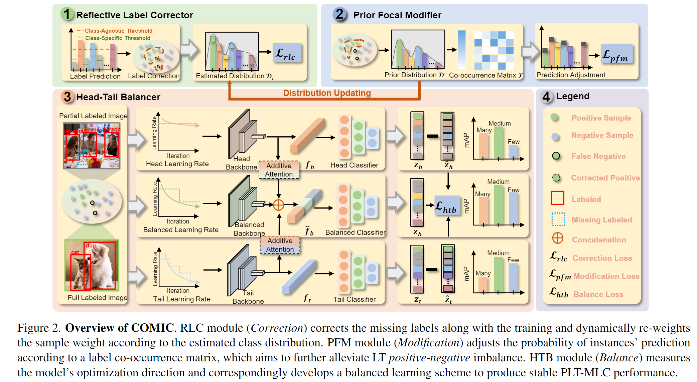
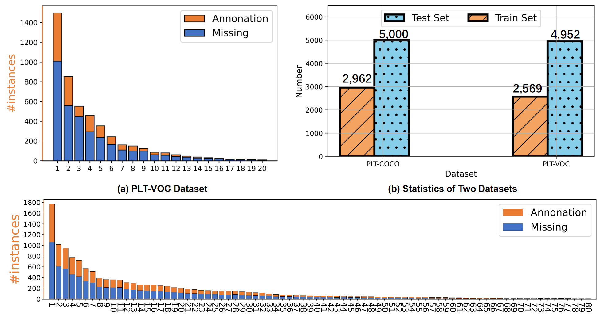

# COMIC: A framework for Partial Labeling and Long-Tailed Multi-Label Classification (PTL-MLC)


## 📄 About

This repository contains **code for our accepted ICCV 2023 paper**:

> **"Learning in Imperfect Environment: Multi-Label Classification with Long-Tailed Distribution and Partial Labels"**.

## Abstract
Conventional multi-label classification (MLC) methods assume that all samples are fully labeled and identically distributed. Unfortunately, this assumption is unrealistic in large-scale MLC data that has long-tailed (LT) distribution and partial labels (PL).
To address the problem, we introduce a novel task, Partial labeling and Long-Tailed Multi-Label Classification (PLT-MLC), to jointly consider the above two imperfect learning environments. Not surprisingly, we find that most LT-MLC and PL-MLC approaches fail to solve the PLT-MLC, resulting in significant performance degradation on the two proposed PLT-MLC benchmarks. end-to-end learning framework: **CO**rrection $\rightarrow$ **M**odificat**I**on $\rightarrow$ balan**C**e, abbreviated as **COMIC**.  Our bootstrapping philosophy is to simultaneously correct the missing labels (Correction) with convinced prediction confidence over a class-aware threshold and to learn from these recall labels during training. We next propose a novel multi-focal modifier loss that simultaneously addresses head-tail imbalance and positive-negative imbalance to adaptively modify the attention to different samples (Modification) under the LT class distribution. We also develop a balanced training strategy by measuring the model's optimization direction towards the head and tail samples, and thus design the balanced classifier (Balance) conditioned on the head and tail optimization to maintain a stable performance. Our experimental study shows that the proposed COMIC significantly outperforms the general MLC, LT-MLC and ML-MLC methods in terms of effectiveness and robustness on our newly created PLT-MLC datasets. 

<div align=center></div>


## 🎓 What’s In This Repo

The proposed dataset and framework implementations of our paper are as follows:

## Environment

- Python==3.8
- Pytorch==1.9.1
- cuda=10.2

## PLT-MLC Datasets 
We release all the PLT-MLC datasets on [link](https://drive.google.com/drive/folders/1_GRaKvV8_5ImrB2UIu9DqJFwuHKtbYZD?usp=share_link)(**PLT-COCO dataset**) and [link](https://drive.google.com/drive/folders/12m7txVHo9jgTKS23kM8n_izXtk7Fh594?usp=share_link) (**PLT-VOC dataset**).  The data distribution and statistics of the developed $\texttt{PLT-COCO}$ dataset and $\texttt{PLT-VOC}$ dataset are shown in the figure below.  We additionally provide the LT-MLC version of the two datasets at [link](https://drive.google.com/drive/folders/10_42yePPX6k9loqVej8XdSl8dU51q-Kz?usp=share_link)(**LT-COCO dataset**) and [link](https://drive.google.com/drive/folders/1UwetFfIZbD5u4NCc3yuS92QySaT3BTZK?usp=share_link) (**LT-VOC dataset**). Notably, we also upload the files of class distribtuion and label co-occurrence matrix in their corresponding link.
<div align=center></div> 

## Pretrained Models  
We also released the pretrained models on [link](https://drive.google.com/file/d/1fIKxnkxJFiY6dGq39W0USo9OzccT2383/view?usp=sharing) (PLT-VOC dataset) and [link](https://drive.google.com/file/d/15trnNAm3d_O-RUDiWWZcXxMPRPNfdOZY/view?usp=sharing) (PLT-COCO dataset) . You can change the **model_path** in the testing code to verify the results.


Performance of the proposed COMIC on two proposed PLT-MLC datasets.
|  Model| Many Shot | Medium Shot | Few Shot | Total Shot|
| ----- | ------ | ------ | ------ |------ |
| COMIC on PLT-COCO | 49.21±0.22|60.08±0.13 |55.36±0.21 |55.08±0.14
| COMIC on PLT-VOC | 73.10±0.35 |89.18±0.45| 84.53±0.48 |81.53±0.35

## Run the Code
All the training and testing codes of our model are written in the shell.txt. For example, if you want to train our model with backbone resnet50 on PLT-COCO dataset, you can run the following command line.

**Training**
```shell
python plt_mlc_main.py --cfg /home/project/COMIC/config/coco/resnet50_plt.yaml
```
You require to edit the configurations in the resnet50_plt.yaml file.
```shell

 resnet50_plt.yaml
    ├── PerformanceLoss
    ├── num_components
    ├── training_opt
    │   └── batch_size    
    │   └── dataset 
    │   └── distribution_path
    │   └── co_occurrence_matrix    
    │   └── train_annatation_path 
    │   └── val_annatation_path 
    │   └── train_data_path    
    │   └── val_data_path 
    │   └── feature_dim 
    │   └── gpu_ids         
```

**Testing**
```shell
python test.py --cfg /home/project/COMIC/config/coco/resnet50_plt.yaml
```

## 🤝 Referencing and Citing 

If you find our work useful in your research and would like to cite our project, please use the following citation:
